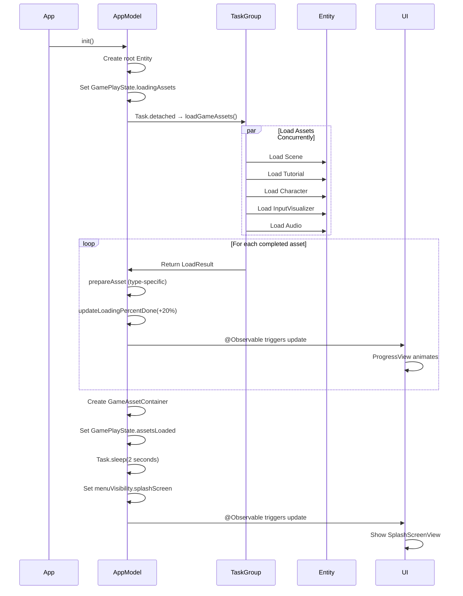

# Asset Loading Progress Architecture Guide

## Table of Contents
1. [Overview](#overview)
2. [Architecture Summary](#architecture-summary)
3. [Key Components](#key-components)
4. [Implementation Flow](#implementation-flow)
5. [Code Patterns](#code-patterns)
6. [Adapting to Your Project](#adapting-to-your-project)
7. [Implementation Checklist](#implementation-checklist)

---

## Overview

This document maps out the asset loading progress technique used in the Petite Asteroids visionOS game. The system provides smooth, real-time progress tracking for parallel asset loading using modern Swift concurrency, SwiftUI reactive UI, and RealityKit's Entity Component System (ECS).

**Key Features:**
- Parallel asset loading with TaskGroup
- Real-time progress updates with SwiftUI binding
- Type-safe asset routing and preparation
- ECS-based state management
- Smooth animated UI feedback

---

## Architecture Summary

### High-Level Flow

```
┌─────────────────────────────────────────────────────────┐
│ 1. INITIALIZATION                                       │
│    - App launches → AppModel.__init__()                 │
│    - Create root Entity with LoadingTrackerComponent    │
│    - Set GamePlayState to .loadingAssets                │
│    - Spawn high-priority Task → loadGameAssets()        │
└─────────────────────────────────────────────────────────┘
                        ↓
┌─────────────────────────────────────────────────────────┐
│ 2. PARALLEL LOADING (TaskGroup)                         │
│    - withTaskGroup creates concurrent loading group     │
│    - 5 assets load simultaneously:                      │
│      • Main Level Scene                                 │
│      • Tutorial Level Scene                             │
│      • Character Model                                  │
│      • Input Visualizer                                 │
│      • Audio Resources (17+ files)                      │
│    - Each returns LoadResult(entity, type)              │
└─────────────────────────────────────────────────────────┘
                        ↓
┌─────────────────────────────────────────────────────────┐
│ 3. PROGRESSIVE PREPARATION                              │
│    - Process TaskGroup results as they complete         │
│    - For each asset:                                    │
│      • Type-specific preparation (physics, materials)   │
│      • Update progress: +20% per asset                  │
│      • withAnimation for smooth UI updates              │
│    - Return prepared asset dictionary                   │
└─────────────────────────────────────────────────────────┘
                        ↓
┌─────────────────────────────────────────────────────────┐
│ 4. ASSET STORAGE & STATE TRANSITION                     │
│    - Create GameAssetContainer component                │
│    - Add to root entity for scene-wide access           │
│    - Set GamePlayState to .assetsLoaded                 │
│    - Wait 2 seconds (menuAppearDelay)                   │
│    - Show splash screen menu                            │
└─────────────────────────────────────────────────────────┘
                        ↓
┌─────────────────────────────────────────────────────────┐
│ 5. UI UPDATES (SwiftUI @Observable)                     │
│    - LoadingView shows ProgressView                     │
│    - Bound to appModel.loadingPercentDone               │
│    - Animated progress bar 0% → 100%                    │
│    - Fade to splash screen when complete                │
└─────────────────────────────────────────────────────────┘
```

### Core Architecture Principles

1. **Separation of Concerns**
   - **Loading Logic**: `AppModel+LoadAssets.swift`
   - **State Management**: ECS Components (GamePlayStateComponent)
   - **UI Layer**: SwiftUI Views (LoadingView)

2. **Parallel-First Design**
   - Assets load concurrently using TaskGroup
   - Progress updates as each completes
   - Minimizes total load time

3. **Type-Safe Asset Routing**
   - `AssetType` enum directs preparation logic
   - `LoadResult` struct carries entity + type
   - Sendable protocol ensures thread safety

4. **Reactive UI**
   - `@Observable` AppModel for automatic updates
   - SwiftUI binding to progress property
   - `withAnimation` for smooth transitions

---

## Key Components

### 1. AppModel (State Container)

**File**: `PetiteAsteroids/AppModel.swift`

```swift
@MainActor
@Observable
class AppModel {
    var loadingPercentDone: Float = 0
    var menuVisibility: MenuVisibility = .hidden

    init() {
        // Initialize root entity with components
        let root = Entity()
        root.components.set(LoadingTrackerComponent())
        root.components.set(GamePlayStateComponent.loadingAssets)

        // Spawn loading task
        Task.detached(priority: .high) { [weak self] in
            await self?.loadGameAssets()
        }
    }
}
```

**Responsibilities:**
- Observable state for UI binding
- Root entity management
- Initiates asset loading task
- Stores progress percentage

---

### 2. AppModel+LoadAssets (Loading Orchestration)

**File**: `PetiteAsteroids/AppModel+LoadAssets.swift`

**Key Methods:**

#### `loadGameAssets() async`
```swift
@MainActor
private func loadGameAssets() async {
    root.components[GamePlayStateComponent.self] = .loadingAssets

    let assetsToLoad: [AssetIdentifier] = [
        AssetIdentifier(name: "Scene", type: .level(gameLevel: .level1)),
        AssetIdentifier(name: "Scene_Tutorial_1", type: .level(gameLevel: .tutorial)),
        AssetIdentifier(name: "Scenes/CharacterRock", type: .character),
        AssetIdentifier(name: "GameAssets/Input_Visualizer", type: .inputVisualizer),
        AssetIdentifier(name: "Audio", type: .audio)
    ]

    await withTaskGroup(of: LoadResult.self) { loadAssetsTaskGroup in
        // Add parallel loading tasks
        for asset in assetsToLoad {
            loadAssetsTaskGroup.addTask { [weak self] in
                guard let self else { fatalError("AppModel lost") }

                switch asset.type {
                case .audio:
                    let audioComponent = try! await AudioResourcesComponent.load()
                    let audioEntity = Entity()
                    audioEntity.components.set(audioComponent)
                    return LoadResult(entity: audioEntity, type: asset.type)

                default:
                    guard let entity = try? await Entity(
                        named: asset.name,
                        in: realityKitContentBundle
                    ) else {
                        fatalError("Failed to load \(asset.name)")
                    }
                    return LoadResult(entity: entity, type: asset.type)
                }
            }
        }

        // Prepare assets as they complete
        let preparedAssets = await prepareGameAssets(
            loadAssetsTaskGroup: loadAssetsTaskGroup,
            assetsToLoad: assetsToLoad
        )

        // Store in root entity
        let assetContainer = GameAssetContainer(
            levels: preparedAssets.levels,
            characterAnimationRoot: preparedAssets.characterAnimationRoot
        )
        root.components.set(assetContainer)
    }

    // Transition to menu
    root.components[GamePlayStateComponent.self] = .assetsLoaded
    try? await Task.sleep(nanoseconds: UInt64(menuAppearDelay * Float(NSEC_PER_SEC)))
    menuVisibility = .splashScreen
}
```

#### `prepareGameAssets() async`
```swift
@MainActor
private func prepareGameAssets(
    loadAssetsTaskGroup: inout TaskGroup<LoadResult>,
    assetsToLoad: [AssetIdentifier]
) async -> (
    levels: [GameLevel: Entity],
    characterAnimationRoot: Entity
) {
    var levels: [GameLevel: Entity] = [:]
    var characterAnimationRoot: Entity?

    // Process results as they complete
    for await unsafe asset in loadAssetsTaskGroup {
        switch asset.type {
        case .level(let gameLevel):
            prepareLevel(level: asset.entity)
            levels[gameLevel] = asset.entity

        case .character:
            prepareCharacter(character: asset.entity)
            characterAnimationRoot = asset.entity

        case .inputVisualizer:
            prepareInputVisualizer(inputVisualizer: asset.entity)

        case .audio:
            root.addChild(asset.entity)
        }

        // Update progress
        updateLoadingPercentDone(
            percent: loadingPercentDone + 1.0 / Float(assetsToLoad.count)
        )
    }

    // Final 100% update
    updateLoadingPercentDone(percent: 1.0)

    return (
        levels: levels,
        characterAnimationRoot: characterAnimationRoot!
    )
}
```

#### `updateLoadingPercentDone()`
```swift
@MainActor
private func updateLoadingPercentDone(percent: Float) {
    withAnimation {
        loadingPercentDone = percent
    }
}
```

**Responsibilities:**
- Create TaskGroup for parallel loading
- Load entities from RealityKit bundles
- Process results as they complete
- Type-specific preparation (physics, materials, components)
- Update progress with animation
- Store prepared assets in component

---

### 3. LoadingView (UI Component)

**File**: `PetiteAsteroids/Views/LoadingView.swift`

```swift
struct LoadingView: View {
    @Environment(AppModel.self) private var appModel

    var body: some View {
        VStack(spacing: 20) {
            Text("Loading Assets")
                .font(.largeTitle)
                .fontWeight(.bold)

            ProgressView(value: appModel.loadingPercentDone)
                .progressViewStyle(.linear)
                .frame(width: 300)

            Text("\(Int(appModel.loadingPercentDone * 100))%")
                .font(.title2)
                .foregroundStyle(.secondary)
        }
        .padding(40)
        .glassBackgroundEffect()
    }
}
```

**Responsibilities:**
- Display progress bar bound to AppModel
- Show percentage text
- Apply visionOS styling

---

### 4. MenuView (View Coordinator)

**File**: `PetiteAsteroids/Views/MenuView.swift`

```swift
struct MenuView: View {
    @Environment(AppModel.self) private var appModel

    var body: some View {
        ZStack {
            if let gamePlayState = appModel.root.components[GamePlayStateComponent.self] {
                switch gamePlayState {
                case .loadingAssets:
                    LoadingView()
                        .transition(.opacity)

                case .assetsLoaded, .introAnimation, .starting, .playing, .outroAnimation, .postGame:
                    switch appModel.menuVisibility {
                    case .splashScreen:
                        SplashScreenView()
                            .transition(.opacity)
                    case .highScore:
                        HighScoreView()
                            .transition(.opacity)
                    case .hidden:
                        EmptyView()
                    }
                }
            }
        }
        .animation(.easeInOut(duration: 0.5), value: appModel.menuVisibility)
    }
}
```

**Responsibilities:**
- Conditionally render views based on state
- Handle transitions between loading/menu/game
- Coordinate animations

---

### 5. GamePlayStateComponent (State Machine)

**File**: `PetiteAsteroids/ECS/Game State/GamePlayStateComponent.swift`

```swift
enum GamePlayStateComponent: Component {
    case loadingAssets      // Initial state
    case assetsLoaded       // After loading completes
    case introAnimation     // Pre-gameplay
    case starting           // Starting gameplay
    case playing(isPaused: Bool)
    case outroAnimation
    case postGame
}
```

**Responsibilities:**
- Define game lifecycle states
- Drive UI transitions
- Coordinate with loading tracker

---

### 6. LoadingTrackerComponent (Operation Counter)

**File**: `PetiteAsteroids/ECS/LoadingTrackerComponent.swift`

```swift
struct LoadingTrackerComponent: Component {
    private var hasStartedLoading: Bool = false
    private var numInProgress: Int = 0

    mutating func start() {
        hasStartedLoading = true
        numInProgress += 1
    }

    mutating func incrementNumInProgress() {
        numInProgress += 1
    }

    mutating func decrementNumInProgress() {
        numInProgress -= 1
    }

    func isComplete() -> Bool {
        return hasStartedLoading && numInProgress == 0
    }
}
```

**Responsibilities:**
- Track in-progress async operations
- Signal when all operations complete
- Used by GamePlayStateSystem for transitions

---

### 7. Asset Data Structures

**File**: `PetiteAsteroids/AppModel+LoadAssets.swift`

```swift
struct AssetIdentifier {
    let name: String
    let type: AssetType
}

enum AssetType {
    case level(gameLevel: GameLevel)
    case character
    case inputVisualizer
    case audio
}

struct LoadResult: Sendable {
    var entity: Entity
    var type: AssetType
}

struct GameAssetContainer: Component {
    let levels: [GameLevel: Entity]
    let characterAnimationRoot: Entity
}
```

**Responsibilities:**
- Type-safe asset identification
- Thread-safe result passing (Sendable)
- Prepared asset storage in ECS

---

### 8. AudioResourcesComponent (Audio Loading)

**File**: `PetiteAsteroids/ECS/Audio/AudioResourcesComponent.swift`

```swift
struct AudioResourcesComponent: Component {
    private var keyToAudioResource: [String: AudioResource] = [:]

    @MainActor
    public static func load() async throws -> AudioResourcesComponent {
        var component = AudioResourcesComponent()

        // Load music with streaming
        component.keyToAudioResource["MenuMusic"] = try await AudioFileResource(
            named: "menu_music",
            configuration: .init(
                loadingStrategy: .stream,
                shouldLoop: true
            )
        )

        // Load SFX with preload
        component.keyToAudioResource["RockHit"] = try await AudioFileResource(
            named: "rock_hit",
            configuration: .init(
                loadingStrategy: .preload,
                shouldLoop: false
            )
        )

        // Additional audio files...

        return component
    }
}
```

**Responsibilities:**
- Load 17+ audio files asynchronously
- Configure streaming vs preload strategies
- Package into single component

---

## Implementation Flow

### Detailed Sequence



### State Transitions

```
.loadingAssets
    ↓ [All assets prepared]
.assetsLoaded
    ↓ [menuAppearDelay elapsed]
menuVisibility = .splashScreen
    ↓ [User taps "Start Game"]
.starting
    ↓ [LoadingTracker complete]
.playing
```

---

## Code Patterns

### Pattern 1: Parallel Loading with TaskGroup

**Purpose**: Load multiple assets concurrently, not sequentially

```swift
await withTaskGroup(of: LoadResult.self) { group in
    // Add tasks
    for asset in assetsToLoad {
        group.addTask {
            let entity = try! await Entity(named: asset.name, in: bundle)
            return LoadResult(entity: entity, type: asset.type)
        }
    }

    // Process as they complete
    for await result in group {
        processAsset(result)
        updateProgress()
    }
}
```

**Key Benefits:**
- All assets load simultaneously
- Progress updates in real-time
- Structured concurrency ensures completion

---

### Pattern 2: Sendable Result Struct

**Purpose**: Thread-safe data passing across async boundaries

```swift
struct LoadResult: Sendable {
    var entity: Entity    // RealityKit Entity is Sendable
    var type: AssetType   // Enum is Sendable
}
```

**Key Benefits:**
- Required for TaskGroup<LoadResult>
- Compiler-verified thread safety
- No data races

---

### Pattern 3: Observable Property Binding

**Purpose**: Automatic UI updates without manual subscriptions

```swift
@MainActor
@Observable
class AppModel {
    var loadingPercentDone: Float = 0
}

struct LoadingView: View {
    @Environment(AppModel.self) private var appModel

    var body: some View {
        ProgressView(value: appModel.loadingPercentDone)
    }
}
```

**Key Benefits:**
- One-way data flow
- No Combine subscriptions
- Simplified state management

---

### Pattern 4: Animated Progress Updates

**Purpose**: Smooth visual transitions

```swift
@MainActor
private func updateLoadingPercentDone(percent: Float) {
    withAnimation {
        loadingPercentDone = percent
    }
}
```

**Key Benefits:**
- Automatic animation
- SwiftUI handles interpolation
- Better UX

---

### Pattern 5: Type-Specific Preparation

**Purpose**: Route assets to appropriate setup logic

```swift
for await asset in taskGroup {
    switch asset.type {
    case .level(let gameLevel):
        prepareLevel(level: asset.entity)
        levels[gameLevel] = asset.entity

    case .character:
        prepareCharacter(character: asset.entity)

    case .audio:
        root.addChild(asset.entity)
    }

    updateProgress()
}
```

**Key Benefits:**
- Type-safe routing
- Extensible for new asset types
- Clear separation of concerns

---

### Pattern 6: Component-Based Storage

**Purpose**: ECS-compatible asset storage

```swift
struct GameAssetContainer: Component {
    let levels: [GameLevel: Entity]
    let characterAnimationRoot: Entity
}

root.components.set(assetContainer)
```

**Key Benefits:**
- Scene-wide access via components
- Fits RealityKit architecture
- Query-friendly

---

### Pattern 7: State Machine with Enum Component

**Purpose**: Track game lifecycle

```swift
enum GamePlayStateComponent: Component {
    case loadingAssets
    case assetsLoaded
    case playing(isPaused: Bool)
}

root.components[GamePlayStateComponent.self] = .loadingAssets
```

**Key Benefits:**
- Type-safe state transitions
- Pattern matching in systems
- Compile-time verification

---

## Adapting to Your Project

### Step 1: Set Up State Container

Create an observable model to hold loading state:

```swift
@MainActor
@Observable
class MyAppModel {
    // Progress tracking
    var loadingProgress: Float = 0
    var isLoading: Bool = true

    // Asset storage
    var loadedAssets: [String: Any] = [:]

    init() {
        Task.detached(priority: .high) { [weak self] in
            await self?.loadAssets()
        }
    }
}
```

---

### Step 2: Define Asset Types

Create enums to identify and route assets:

```swift
enum MyAssetType {
    case model(name: String)
    case texture(name: String)
    case audio(name: String)
    case scene(name: String)
}

struct MyAssetIdentifier {
    let name: String
    let type: MyAssetType
}

struct MyLoadResult: Sendable {
    let data: Any // Replace with your asset type
    let type: MyAssetType
}
```

---

### Step 3: Implement Parallel Loading

Use TaskGroup to load assets concurrently:

```swift
@MainActor
func loadAssets() async {
    let assetsToLoad: [MyAssetIdentifier] = [
        MyAssetIdentifier(name: "MainScene", type: .scene(name: "main")),
        MyAssetIdentifier(name: "PlayerModel", type: .model(name: "player")),
        MyAssetIdentifier(name: "BackgroundMusic", type: .audio(name: "bgm")),
        // Add more assets...
    ]

    await withTaskGroup(of: MyLoadResult.self) { group in
        // Add loading tasks
        for asset in assetsToLoad {
            group.addTask {
                let data = await self.loadAssetByType(asset)
                return MyLoadResult(data: data, type: asset.type)
            }
        }

        // Process results as they complete
        for await result in group {
            await self.prepareAsset(result)
            await self.updateProgress(increment: 1.0 / Float(assetsToLoad.count))
        }
    }

    isLoading = false
}
```

---

### Step 4: Type-Specific Loading

Implement loaders for each asset type:

```swift
@MainActor
private func loadAssetByType(_ asset: MyAssetIdentifier) async -> Any {
    switch asset.type {
    case .model:
        // Load 3D model
        return await loadModel(named: asset.name)

    case .texture:
        // Load texture/image
        return await loadTexture(named: asset.name)

    case .audio:
        // Load audio file
        return await loadAudio(named: asset.name)

    case .scene:
        // Load scene data
        return await loadScene(named: asset.name)
    }
}
```

---

### Step 5: Implement Progress Updates

Update progress with animation:

```swift
@MainActor
private func updateProgress(increment: Float) {
    withAnimation(.easeInOut(duration: 0.3)) {
        loadingProgress += increment
        loadingProgress = min(loadingProgress, 1.0) // Clamp to 100%
    }
}
```

---

### Step 6: Create Loading UI

Build a SwiftUI view with progress indicator:

```swift
struct MyLoadingView: View {
    @Environment(MyAppModel.self) private var model

    var body: some View {
        VStack(spacing: 24) {
            Text("Loading")
                .font(.title)

            ProgressView(value: model.loadingProgress)
                .progressViewStyle(.linear)
                .frame(maxWidth: 400)

            Text("\(Int(model.loadingProgress * 100))%")
                .font(.headline)
                .foregroundStyle(.secondary)
        }
        .padding()
    }
}
```

---

### Step 7: Integrate into Main View

Conditionally show loading view:

```swift
struct MyMainView: View {
    @Environment(MyAppModel.self) private var model

    var body: some View {
        ZStack {
            if model.isLoading {
                MyLoadingView()
                    .transition(.opacity)
            } else {
                MyGameView()
                    .transition(.opacity)
            }
        }
        .animation(.easeInOut, value: model.isLoading)
    }
}
```

---

### Step 8: Add Asset Preparation

Post-load processing for each asset:

```swift
@MainActor
private func prepareAsset(_ result: MyLoadResult) async {
    switch result.type {
    case .model(let name):
        // Configure model (physics, materials, etc.)
        let model = result.data as! ModelEntity
        configureModel(model)
        loadedAssets[name] = model

    case .texture(let name):
        // Process texture
        let texture = result.data as! TextureResource
        loadedAssets[name] = texture

    case .audio(let name):
        // Set up audio
        let audio = result.data as! AudioFileResource
        loadedAssets[name] = audio

    case .scene(let name):
        // Build scene graph
        let scene = result.data as! Entity
        setupScene(scene)
        loadedAssets[name] = scene
    }
}
```

---

### Step 9: Handle Errors Gracefully

Add error handling and retry logic:

```swift
@MainActor
private func loadAssetByType(_ asset: MyAssetIdentifier) async -> Any? {
    var retryCount = 0
    let maxRetries = 3

    while retryCount < maxRetries {
        do {
            switch asset.type {
            case .model:
                return try await loadModel(named: asset.name)
            case .texture:
                return try await loadTexture(named: asset.name)
            // ... other types
            }
        } catch {
            retryCount += 1
            print("Failed to load \(asset.name), retry \(retryCount)/\(maxRetries)")

            if retryCount < maxRetries {
                try? await Task.sleep(for: .seconds(1))
            } else {
                print("Failed to load \(asset.name) after \(maxRetries) retries")
                return nil // or provide default asset
            }
        }
    }

    return nil
}
```

---

### Step 10: Optimize with Priorities

Prioritize critical assets:

```swift
enum AssetPriority {
    case critical    // Must load for app to function
    case high        // Load early for better UX
    case normal      // Standard loading
    case low         // Can defer or lazy load
}

struct MyAssetIdentifier {
    let name: String
    let type: MyAssetType
    let priority: AssetPriority
}

@MainActor
func loadAssets() async {
    let sorted = assetsToLoad.sorted { $0.priority < $1.priority }

    // Load critical assets first
    for asset in sorted.filter({ $0.priority == .critical }) {
        await loadAndPrepare(asset)
    }

    // Then load remaining in parallel
    await withTaskGroup(of: MyLoadResult.self) { group in
        for asset in sorted.filter({ $0.priority != .critical }) {
            group.addTask {
                return await self.loadAssetByType(asset)
            }
        }

        for await result in group {
            await prepareAsset(result)
            await updateProgress()
        }
    }
}
```

---

## Implementation Checklist

### Phase 1: Foundation
- [ ] Create observable model with progress property
- [ ] Define asset type enums
- [ ] Create LoadResult struct with Sendable conformance
- [ ] Set up asset identifier structure

### Phase 2: Loading System
- [ ] Implement TaskGroup-based parallel loading
- [ ] Create type-specific asset loaders
- [ ] Add error handling and retry logic
- [ ] Implement progress calculation

### Phase 3: Preparation
- [ ] Write asset preparation functions
- [ ] Add type-specific configuration logic
- [ ] Implement asset storage mechanism
- [ ] Create asset container/manager

### Phase 4: UI Integration
- [ ] Build loading view with ProgressView
- [ ] Add percentage display
- [ ] Implement animated transitions
- [ ] Create view coordinator for state switching

### Phase 5: State Management
- [ ] Define app state enum
- [ ] Implement state machine logic
- [ ] Add state transition triggers
- [ ] Connect loading completion to state

### Phase 6: Optimization
- [ ] Add asset priority system
- [ ] Implement critical asset preloading
- [ ] Add lazy loading for deferred assets
- [ ] Profile and optimize bottlenecks

### Phase 7: Polish
- [ ] Add loading animations
- [ ] Implement smooth transitions
- [ ] Add error state UI
- [ ] Create retry mechanisms

### Phase 8: Testing
- [ ] Test with various asset counts
- [ ] Verify parallel loading performance
- [ ] Test error scenarios
- [ ] Validate progress accuracy

---

## Advanced Techniques

### Technique 1: Streaming vs. Preload Strategy

For audio/video, choose loading strategy based on size:

```swift
// Large files - stream to reduce memory
let bgMusic = try await AudioFileResource(
    named: "background_music",
    configuration: .init(
        loadingStrategy: .stream,
        shouldLoop: true
    )
)

// Small files - preload for instant playback
let clickSound = try await AudioFileResource(
    named: "click",
    configuration: .init(
        loadingStrategy: .preload,
        shouldLoop: false
    )
)
```

---

### Technique 2: Hierarchical Loading

Load parent containers first, then children:

```swift
struct HierarchicalLoader {
    func loadSceneHierarchy() async {
        // Load root scene
        let rootScene = await loadScene("Root")
        updateProgress(0.2)

        // Load children in parallel
        await withTaskGroup(of: Entity.self) { group in
            for childName in rootScene.childNames {
                group.addTask {
                    return await loadScene(childName)
                }
            }

            for await child in group {
                rootScene.addChild(child)
                updateProgress(0.1)
            }
        }
    }
}
```

---

### Technique 3: Cached Loading

Avoid reloading assets across sessions:

```swift
@MainActor
class CachedAssetLoader {
    static let cache = NSCache<NSString, Any>()

    func loadWithCache(name: String) async -> Entity? {
        // Check cache first
        if let cached = Self.cache.object(forKey: name as NSString) as? Entity {
            return cached
        }

        // Load and cache
        guard let entity = try? await Entity(named: name, in: bundle) else {
            return nil
        }

        Self.cache.setObject(entity, forKey: name as NSString)
        return entity
    }
}
```

---

### Technique 4: Progressive Enhancement

Show low-res assets first, upgrade later:

```swift
func loadProgressive(model: String) async {
    // Load low-poly version immediately
    let lowPoly = await loadModel("\(model)_low")
    display(lowPoly)
    updateProgress(0.3)

    // Load high-poly in background
    Task {
        let highPoly = await loadModel("\(model)_high")
        replace(lowPoly, with: highPoly)
        updateProgress(0.7)
    }
}
```

---

### Technique 5: Asset Bundles

Organize assets into loadable bundles:

```swift
struct AssetBundle {
    let name: String
    let assets: [MyAssetIdentifier]
    let priority: AssetPriority
}

func loadBundles(_ bundles: [AssetBundle]) async {
    for bundle in bundles.sorted(by: { $0.priority < $1.priority }) {
        await loadBundle(bundle)
        updateProgress(1.0 / Float(bundles.count))
    }
}
```

---

## Key Files Reference

### Petite Asteroids Implementation

| File | Purpose | Lines |
|------|---------|-------|
| `AppModel.swift` | Observable state container | ~150 |
| `AppModel+LoadAssets.swift` | Loading orchestration | ~400 |
| `LoadingView.swift` | Progress UI | ~50 |
| `MenuView.swift` | View coordinator | ~100 |
| `GamePlayStateComponent.swift` | State machine | ~30 |
| `LoadingTrackerComponent.swift` | Operation counter | ~40 |
| `AudioResourcesComponent.swift` | Audio loading | ~250 |
| `EntityExtensions.swift` | Entity utilities | ~200 |

---

## Performance Considerations

### Memory Management
- Use `weak self` in Task closures to prevent retain cycles
- Stream large audio/video files instead of preloading
- Release temporary entities after preparation
- Use NSCache for reusable assets

### Timing Optimization
- Load critical assets first (blocking)
- Load non-critical assets in parallel (background)
- Defer heavy processing (collision generation) to post-load
- Use Task priorities appropriately (.high for loading)

### UI Responsiveness
- All progress updates on @MainActor
- Use `withAnimation` for smooth transitions
- Avoid blocking main thread during preparation
- Batch UI updates when possible

### Network Assets
- Add timeout logic for remote assets
- Implement retry with exponential backoff
- Show network-specific error messages
- Cache downloaded assets locally

---

## Common Pitfalls

### Pitfall 1: Sequential Loading
❌ **Wrong**: Loading assets one at a time
```swift
let asset1 = await load("Asset1")
let asset2 = await load("Asset2")
let asset3 = await load("Asset3")
```

✅ **Correct**: Loading in parallel
```swift
await withTaskGroup(of: Asset.self) { group in
    group.addTask { await load("Asset1") }
    group.addTask { await load("Asset2") }
    group.addTask { await load("Asset3") }
}
```

---

### Pitfall 2: Forgetting @MainActor
❌ **Wrong**: Updating UI from background
```swift
Task {
    let asset = await load()
    self.progress += 0.1 // Data race!
}
```

✅ **Correct**: Ensuring main actor isolation
```swift
Task { @MainActor in
    let asset = await load()
    self.progress += 0.1 // Safe
}
```

---

### Pitfall 3: Non-Sendable Types
❌ **Wrong**: Passing non-Sendable across boundaries
```swift
class AssetResult { // Not Sendable
    var entity: Entity
}

await withTaskGroup(of: AssetResult.self) { ... } // Error!
```

✅ **Correct**: Using Sendable types
```swift
struct AssetResult: Sendable {
    var entity: Entity
}

await withTaskGroup(of: AssetResult.self) { ... } // OK
```

---

### Pitfall 4: Progress Math Errors
❌ **Wrong**: Progress exceeding 100%
```swift
progress += 0.2 // No bounds checking
```

✅ **Correct**: Clamping progress
```swift
progress = min(progress + 0.2, 1.0)
```

---

### Pitfall 5: Retain Cycles
❌ **Wrong**: Strong reference in closure
```swift
Task {
    await self.loadAssets() // Retains self
}
```

✅ **Correct**: Weak reference
```swift
Task { [weak self] in
    await self?.loadAssets()
}
```

---

## Additional Resources

### Related Files in Petite Asteroids
- `EntityExtensions.swift` - Utility methods for entity traversal
- `MeshUtilities.swift` - Collision shape generation
- `GamePlayStateSystem.swift` - State transition logic
- `NotificationComponent.swift` - Event propagation pattern

### Apple Documentation
- [Swift Concurrency](https://docs.swift.org/swift-book/LanguageGuide/Concurrency.html)
- [TaskGroup](https://developer.apple.com/documentation/swift/taskgroup)
- [Observable Macro](https://developer.apple.com/documentation/observation/observable())
- [RealityKit Entity Loading](https://developer.apple.com/documentation/realitykit/entity)
- [Audio File Resources](https://developer.apple.com/documentation/realitykit/audiofileresource)

### Patterns & Architecture
- Entity Component System (ECS) pattern
- Observable state pattern
- Structured concurrency
- Parallel loading with progress tracking

---

## Summary

This asset loading architecture provides:

✅ **Parallel loading** via TaskGroup for optimal performance
✅ **Real-time progress** with SwiftUI @Observable binding
✅ **Type-safe routing** with enums and Sendable structs
✅ **Smooth UI updates** via withAnimation
✅ **ECS integration** for state management
✅ **Error handling** with retry logic
✅ **Flexible preparation** with type-specific logic
✅ **Thread safety** via @MainActor and Sendable

By following this guide, you can implement a robust, performant, and user-friendly asset loading system in your own projects.

---

**Generated from**: Petite Asteroids visionOS Game
**Architecture Analysis Date**: 2025-11-11
**Document Version**: 1.0
